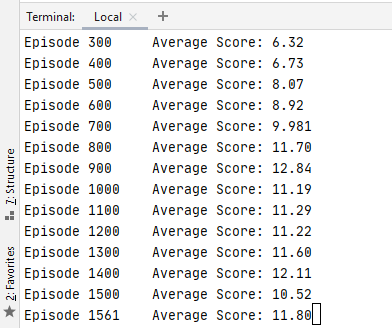
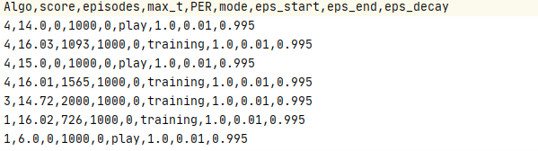
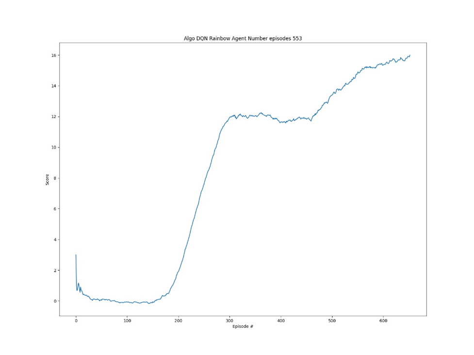
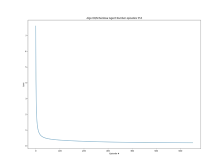

# Udacity_Banana_Unity
Udacity Project Navigation Report

### Introduction
In this document I will cover the explanation and description of my solution to The Challenge project Navigation for
the Deep Reinforcement Learning Nanodegree of Udacity. My solution covers 8 different algorithms as I wanted to 
explore all possible improvements to the Vanilla deep RL DQN algorithm. The skeleton of this solution is based on 
the coding Exercise Deep Q-Networks (lesson 2) of this program, while I also use other resources like books, or public 
information available that I will detail on the references.

The application solves the environment with the following 8 implementations
- Mode 1 Plain Deep DQN vanilla. (Epsilon Greedy algo for action selection)
- Mode 2 Duelling DQN  (Epsilon Greedy algo for action selection)
- Mode 3 Duelling DQN with Priority Experience Replay (Epsilon Greedy algo for action selection)
- Mode 4 Categorical DQN (Epsilon Greedy algo for action selection)
- Mode 5 Duelling DQN, with PER replay and Noisy Layer for exploration. (Noisy Layer for action selection)
- Mode 6 DQN n-steps (Epsilon Greedy algo for action selection)
- Mode 7 Rainbow DQN (Duelling DQN + n-Steps + Categorical + Noisy Layer + PER) (Noisy Layer for action selection)
- Mode 8 Duelling DQN with Noisy Layer (Noisy Layer for action selection)

### Installation
My solution works as an stand alone application which run in a Windows Pro 10 64 bits command line window 
(I did not try in Linux, but I suspect that with minimum changes it will work). 

### Setup the environment
1 create a conda environment    
    
    conda create --name drlnd python=3.6 
    activate drlnd
2 install gym library
    
    pip install gym or pip install gym[atari] 

3 clone this repo

    git clone https://github.com/olonok69/Udacity_Banana_Unity.git
    cd Udacity_Banana_Unity
4 install rest of dependencies (I left a file with the content of all libraries of my setup named pip_library.txt)

    pip install -r requirements.txt
    
5 install a kernel in jupyter(optional)
    
    python -m ipykernel install --user --name drlnd --display-name "drlnd"

6 Install Unity agent (in repo you have the windows 64 version, but if you plan to install it)
- Linux https://s3-us-west-1.amazonaws.com/udacity-drlnd/P1/Banana/Banana_Linux.zip
- MacOs https://s3-us-west-1.amazonaws.com/udacity-drlnd/P1/Banana/Banana.app.zip
- Win32 https://s3-us-west-1.amazonaws.com/udacity-drlnd/P1/Banana/Banana_Windows_x86.zip
- Win64 https://s3-us-west-1.amazonaws.com/udacity-drlnd/P1/Banana/Banana_Windows_x86_64.zip

  Then, place the file in the Udacity_Banana_Unity/ folder and unzip (or decompress) the file.

### Environment

  A reward of +1 is provided for collecting a yellow banana, and a reward of -1 is provided for collecting a blue banana. 
  Thus, the goal of your agent is to collect as many yellow bananas as possible while avoiding blue bananas.

  The state space has 37 dimensions and contains the agent's velocity, along with ray-based perception of objects 
  around the agent's forward direction. Given this information, the agent has to learn how to best select actions. 
  Four discrete actions are available, corresponding to:

* 0 - move forward.
* 1 - move backward.
* 2 - turn left.
* 3 - turn right.

  The task is episodic, and in order to solve the environment, your agent must get an average score of +13 over 100 
  consecutive episodes.

### how to run this project

on the main directory run python main.py --mode [training|play|compare|compare_play|plot] --type[1,2,3,4,5,6,7,8]
both args are mandatory

--mode  training|play|compare|compare_play|plot  Mandatory

* training : Train and agent. Save a model policy if the agent get more or equals than 13 
* play : play an agent with a save policy and report the score
* compare : train all solvers and collect information for reporting
* compare_play : play all solvers and collect information for reporting
* plot : generate the plot from information collected in compare modes

--type  Mandatory
* type 1-->Vanilla DQN 
* type 2--> Duelling DQN PBR 
* type 3--> Duelling DQN no PBR
* type 4--> categorical DQN
* type 5--> Duelling DQN with Noisy layer and PBR
* Type 6--> DQN n-steps
* Type 7 --> Rainbow DQN
* Type 8--> Duelling DQN with Noisy layer No PBR

Ex. python main.py --mode training --type 1

the script during training is printing the average reward every episode

also the script track the configuration of the algorithm and mode use on training or play modes in a csv file

and during training mode we save loss and rewards to finally plot them one the game finish, which is either after 2000
episodes or where the agent reach 16 as reward in training

Rewards

Loss

