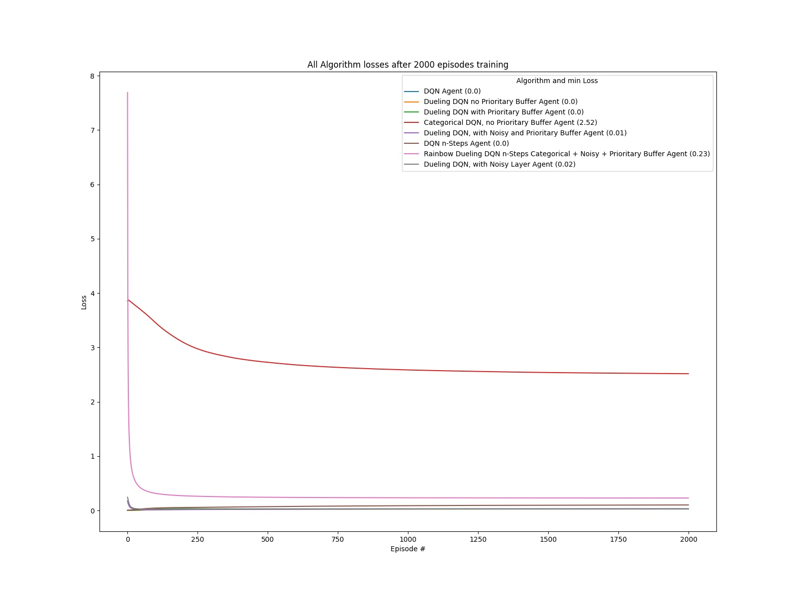
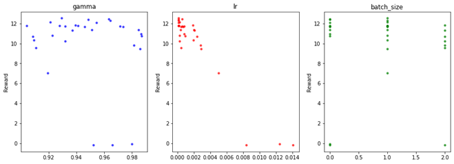

# Udacity_Banana_Unity

### Introduction
This repo contains my solution to The Challenge for the project Navigation part of the Udacity Deep Reinforcement 
Learning Nanodegree. My solution covers 8 different algorithms as I wanted to explore all possible 
improvements to the Vanilla deep RL DQN algorithm. The skeleton of this solution is based on the coding Exercise 
Deep Q-Networks (lesson 2) of this program, while I also use other resources like books, or public 
information available that I will detail on the references.

The application solves the environment with the following 8 implementations
- Mode 1 Plain Deep DQN vanilla. (Epsilon Greedy algo for action selection)
- Mode 2 Dueling DQN  (Epsilon Greedy algo for action selection)
- Mode 3 Dueling DQN with Priority Experience Replay (Epsilon Greedy algo for action selection)
- Mode 4 Categorical DQN (Epsilon Greedy algo for action selection)
- Mode 5 Dueling DQN, with PER replay and Noisy Layer for exploration. (Noisy Layer for action selection)
- Mode 6 DQN n-steps (Epsilon Greedy algo for action selection)
- Mode 7 Rainbow DQN (Dueling DQN + n-Steps + Categorical + Noisy Layer + PER) (Noisy Layer for action selection)
- Mode 8 Dueling DQN with Noisy Layer (Noisy Layer for action selection)

### Installation
My solution works as an stand alone application which run in a Windows Pro 10 64 bits command line window 
(I did not try in Linux, but I suspect that with minimum changes it will work). 

### Setup the environment
1 create a conda environment    
    
    conda create --name drlnd python=3.6 
    activate drlnd
2 install gym library
    
    pip install gym or pip install gym[atari] 

3 clone this repo

    git clone https://github.com/olonok69/Udacity_Banana_Unity.git
    cd Udacity_Banana_Unity
4 install rest of dependencies (I left a file with the content of all libraries of my setup named pip_library.txt)

    pip install -r requirements.txt
    
5 install a kernel in jupyter(optional)
    
    python -m ipykernel install --user --name drlnd --display-name "drlnd"

6 Install Unity agent (in repo you have the windows 64 version, but if you plan to install it)
- Linux https://s3-us-west-1.amazonaws.com/udacity-drlnd/P1/Banana/Banana_Linux.zip
- MacOs https://s3-us-west-1.amazonaws.com/udacity-drlnd/P1/Banana/Banana.app.zip
- Win32 https://s3-us-west-1.amazonaws.com/udacity-drlnd/P1/Banana/Banana_Windows_x86.zip
- Win64 https://s3-us-west-1.amazonaws.com/udacity-drlnd/P1/Banana/Banana_Windows_x86_64.zip

  Then, place the file in the Udacity_Banana_Unity/ folder and unzip (or decompress) the file.

### Environment

  A reward of +1 is provided for collecting a yellow banana, and a reward of -1 is provided for collecting a blue banana. 
  Thus, the goal of your agent is to collect as many yellow bananas as possible while avoiding blue bananas.

  The state space has 37 dimensions and contains the agent's velocity, along with ray-based perception of objects 
  around the agent's forward direction. Given this information, the agent has to learn how to best select actions. 
  Four discrete actions are available, corresponding to:

* 0 - move forward.
* 1 - move backward.
* 2 - turn left.
* 3 - turn right.

  The task is episodic, and in order to solve the environment, your agent must get an average score of +13 over 100 
  consecutive episodes.

### how to run this project

on the main directory run python main.py --mode [training|play|compare|compare_play|plot|hp_tuning] 
                                                --type[1,2,3,4,5,6,7,8]

both args are mandatory

--mode  training|play|compare|compare_play|plot|hp_tuning --> Mandatory

* training : Train and agent. Save a model policy if the agent get more or equals than 13 
* play : play an agent with a save policy and report the score
* compare : train all solvers and collect information for reporting
* compare_play : play all solvers and collect information for reporting
* plot : generate the plot from information collected in compare modes
* hp_tuning :  hyper parameter tuning example

--type --> Mandatory
* type 1-->Vanilla DQN 
* type 2--> Duelling DQN PBR 
* type 3--> Duelling DQN no PBR
* type 4--> categorical DQN
* type 5--> Duelling DQN with Noisy layer and PBR
* Type 6--> DQN n-steps
* Type 7 --> Rainbow DQN
* Type 8--> Duelling DQN with Noisy layer No PBR

Ex. python main.py --mode training --type 1
### Directory Structure
* env: the unity environment
* images: Folder where I save plots during training and final plots
* models: Folder where I save the operational models
* monitor: Folder where I save a csv file where I am collecting information of experiments
* outputs: Folder where I save a pickle file containing a dictionary which contains all data to build the final plots and this report
* src: contains python scripts with classes to support the application
* In the root I have the python scripts, and some cmd scripts to help to run in a loop the environment using different algorithms either during training phase or during play phase

###files
* root
  - Main.py: Contains the logic which govern the 5 main operations modes
  - Run.bat and run_play.bat are two cmd scripts to help me to run all solvers in a loop in training and play mode
* In src folder
  - Agents.py: contains classes which wrap the operation of the Banana env working with different algorithms and buffers. Additionally, some functions to operate the env in training or play mode
  - Networks: contains different implementation of Neural Network architectures use by the agents to solve the environment
  - Buffers.py: contains different buffer implementations. Senment_tree.py and sumtree.py contains classes only use by the different buffers.
  - Hyper.py: contains functions and wrappers for hyper parameter tuning
  - Utils.py: contains helpers to monitor, plot and instantiate the agents
* in env folder
  - Banana.exe and UnityPlayer.dll are the Unity Banana environment

* 

the script during training is printing the average reward every episode

also the script track the configuration of the algorithm and mode use on training or play modes in a csv file

and during training mode we save loss and rewards to finally plot them one the game finish, which is either after 2000
episodes or where the agent reach 16 as reward in training

Ex. Rewards

### Mode Compare
run all solvers 2000 episodes and collect statistics. Use run.bat
### Mode Compare_plot
Run all solvers in mode play and collect statistics. Use run_play.bat
### Mode plot
after runing the application in mode compare and the compare_play, where the app collect information to later in mode 
plot generate 5 graphs which compare the performance of the 8 solvers

All algorithms Rewards after 2000 episodes

All algorithms Loss after 2000 episodes

All algorithms Number of Episodes to win the Environtment (collect 13 yellow bananas)

All algorithms Time to win the Environtment (collect 13 yellow bananas)

All algorithms mode play score with best policy

### Mode hp_tuning

In mode hp_tuning and using library Hyperopt library, I setup an example of how to optimize parameters of an agent 
using Bayesian Optimization. It it’s just a simple example but give you a grasp of how we can optimize the 
parameters. There are other frameworks to optimize parameters like RL Baselines3 Zoo if we use Stable baselines library 
or Ray for unity RL agents, but here as this is a tailored environment, I decided to use a general optimization framework 
and also learn how to use it in Deep RL.
Here in this simple configuration, I am optimizing 3 parameters of the Vanilla DQN agent model and I limit the trials 
to 30 for this experiment

### References

1.	V. Mnih et al., "Human-level control through deep reinforcement learning." Nature, 518 (7540):529–533, 2015.
2.	van Hasselt et al., "Deep Reinforcement Learning with Double Q-learning." arXiv preprint arXiv:1509.06461, 2015.
3.	T. Schaul et al., "Prioritized Experience Replay." arXiv preprint arXiv:1511.05952, 2015.
4.	Z. Wang et al., "Dueling Network Architectures for Deep Reinforcement Learning." arXiv preprint arXiv:1511.06581, 2015.
5.	M. Fortunato et al., "Noisy Networks for Exploration." arXiv preprint arXiv:1706.10295, 2017.
6.	M. G. Bellemare et al., "A Distributional Perspective on Reinforcement Learning." arXiv preprint arXiv:1707.06887, 2017.
7.	R. S. Sutton, "Learning to predict by the methods of temporal differences." Machine learning, 3(1):9–44, 1988.
8.	M. Hessel et al., "Rainbow: Combining Improvements in Deep Reinforcement Learning." arXiv preprint arXiv:1710.02298, 2017.
9.	https://github.com/Curt-Park/rainbow-is-all-you-need
10.	Hands-on Reinforcement Learning for Games (Book) Michael Lanham
11.	Grokking Deep Reinforcement Learning (Book) Miguel Morales
12.	Hands-on Reinforcement Learning with Python (book) by Sudharsan Ravichandiran
13.	binary sum-tree. See Appendix B.2.1. in https://arxiv.org/pdf/1511.05952.pdf. Adapted implementation from https://github.com/jaromiru/AI-blog/blob/master/SumTree.py  
14.	SegmentTree from OpenAi repository. https://github.com/openai/baselines/blob/master/baselines/common/segment_tree.py
15.	PER implementation. https://github.com/rlcode/per/blob/master/prioritized_memory.py
16.	Noisy Layers . https://github.com/higgsfield/RL-Adventure/blob/master/5.noisy%20dqn.ipynb    https://github.com/Kaixhin/Rainbow/blob/master/model.py

